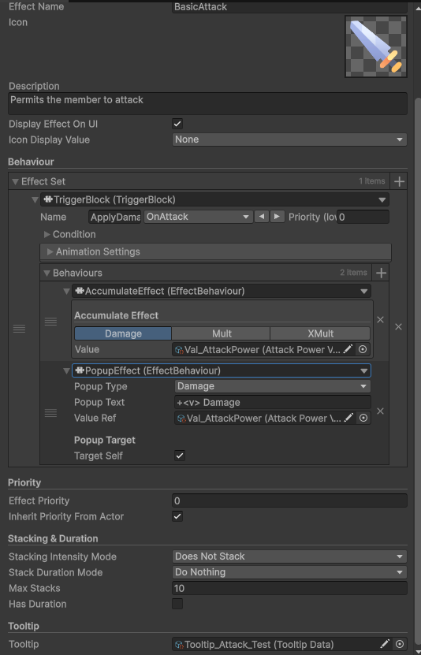
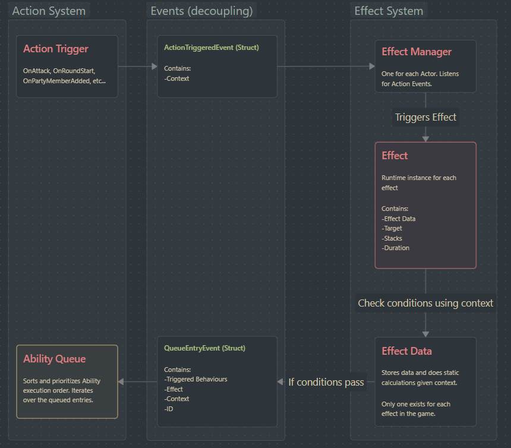

<h1 align="center">🐾 Bakeneko 🐾</h1>

<p align="center">
  <b>Rogue-like Auto-Battler | Systems Showcase | In Development</b><br>
  A technical and design-focused public showcase documenting architecture, gameplay systems, and development progress.
</p>

<p align="center">
  <a href="YOUR_ITCH_IO_LINK_HERE">
    
  </a>
  <br><br>
  <a href="YOUR_YOUTUBE_LINK_HERE">
    
  </a>
</p>

---

## 📸 Gameplay Preview

<p align="center">
  
  
  
</p>

---

## 🩸 Project Overview

**Bakeneko** is an in-development rogue-like auto-battler centered around modular systems design, replayability, and strategic emergent gameplay.

### Core Pillars:
- 🧩 **Modular Action & Event Architecture** — Flexible, decoupled systems enabling complex interactions. Gives designers a way to make bespoke abilities by arranging smaller modules, no code needed.

- 🎮 **UI Focus Priority & Adaptive Pickup/Drop System** — Seamless mouse/controller transitions, event-driven pickup/drop architecture, auto-arranging party logic, and decoupled party-state integration.

- 🃏 **Rogue-like Party Progression** — Encounter deck systems, strategic roster growth, and systemic progression loops.
  

---

## 🧩 Technical Highlight - Modular Action & Event Architecture

A modular, data-driven combat framework built around **Trigger → Condition → Behaviour** pipelines authored entirely through Unity’s inspector.  
  
### System Goal:  
Allow designers to create:  
- Status effects    
- Reactive abilities    
- Synergies    
- Buff / Debuff systems    
- Conditional combat logic    
  
**Without requiring effect-specific runtime code.**  

---
### Key Features  
  
- **Designer-Owned Content Pipeline** — Effects are authored through composable `ScriptableObject` blocks    
- **Decoupled Event Architecture** — Combat systems communicate through broadcasted actions rather than direct references    
- **Extensible Behaviour System** — New behaviours are implemented once and immediately become globally authorable    
- **Frame-Safe Action Queue** — Sequenced execution prevents re-entrant combat bugs    
- **Allocation-Conscious Runtime Design** — Struct-based `ActionContext` minimizes heap pressure    
- **Inspector Tooling** — Odin-powered validation and clean conditional authoring workflows    
  
---  
### Effect Data (for designers)
<p align="center">
  
</p>

---
### Why This Architecture Matters  
  
### Production Value:  
- Reduces programmer bottlenecks    
- Enables rapid design iteration    
- Supports scalable content expansion    
- Minimizes coupling between systems    
- Maintains deterministic combat sequencing    
  
### Engineering Value:  
- ScriptableObject data separation    
- Runtime state isolation    
- Event-driven system design    
- Extensibility-first architecture    
- Performance-conscious execution    
  
---  
  
### Architecture Overview

<p align="center">
  
</p>
---

### Selected Snippet — Action Queue Protocol

Every combat action follows a **register → fire → resolve** pipeline:

```csharp
/// Action Context Struct
public readonly void Queue()  
{  
	// 1. snapshot queue depth before any entries arrive
    abilityQueue.RegisterAction(ActionID);      
    
    // 2. fire — listeners enqueue their ability entries
    ActionContextEvent.TriggerAction(this);     
    
    // 3. done — queue checks delta and advances if needed
    abilityQueue.ActionContextQueued(ActionID); 
}
```

### Why This Matters

This protocol ensures:

- Deterministic chain resolution
- Safe cascading reactions
- Shared execution model for both external and internal events
- Predictable sequencing across combat systems

---

### Engineering Outcomes
This system shifts combat implementation from **Hardcoded one-off ability logic** to  **Composable systemic gameplay architecture**

- Reduced programmer dependency for effect creation
- Enabled designer-authored combat content
- Minimized runtime allocations on Hot Path
- Created scalable foundations for:
    - Abilities
    - Status systems
    - Item synergies
    - Encounter modifiers
    - Future game modes

**[Read Full Technical Breakdown](./effect-system)**
